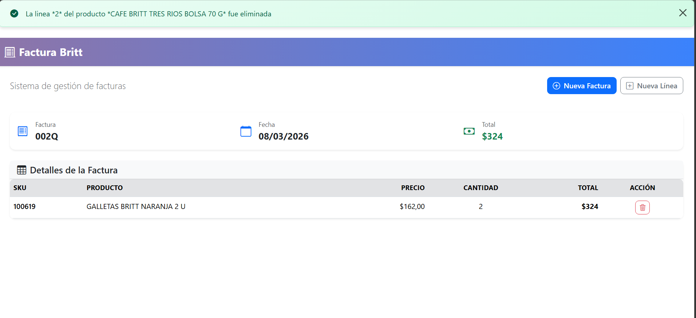

# Prueba tecnica 1

## Referencias

Especificación de la API:  https://documenter.getpostman.com/view/42538225/2sBXcGCecC 
End-point base: https://apidev.cafebritt.com/test/functions/api.cfc?method=&token= 

## Consideraciones

- Las vulnerabilidades reportadas provienen de Angular CLI y dependencias de construcción (webpack, esbuild, etc.). Arreglarlas requiere actualizar Angular a la versión 21, lo cual introduce cambios incompatibles y está fuera del alcance de este proyecto.

- Se refactorizó el `BillingService`eliminando la lógica duplicada de manejo de errores y para mejorar la legibilidad al centralizar la configuración de la API y la gestión de errores.

## Prueba

